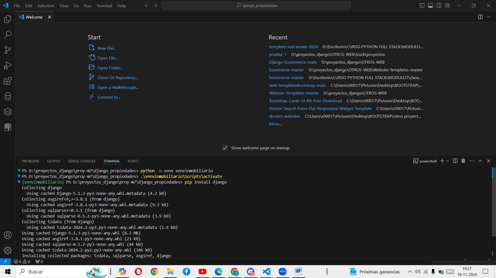
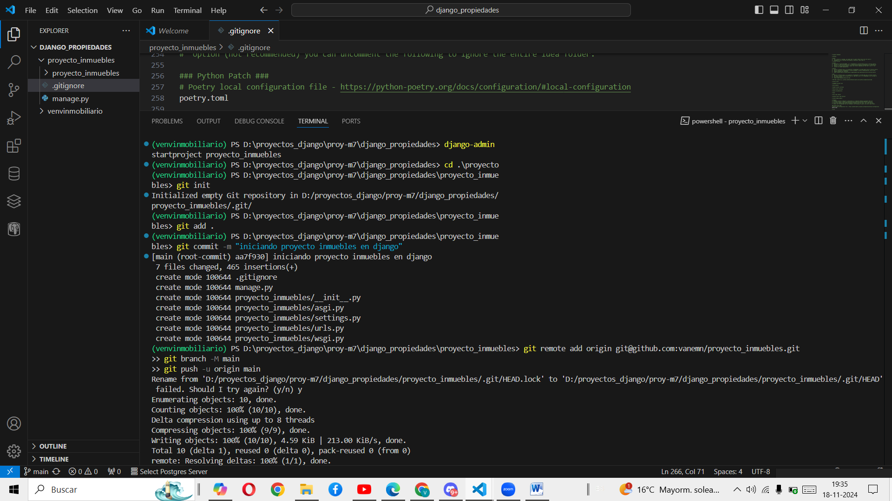
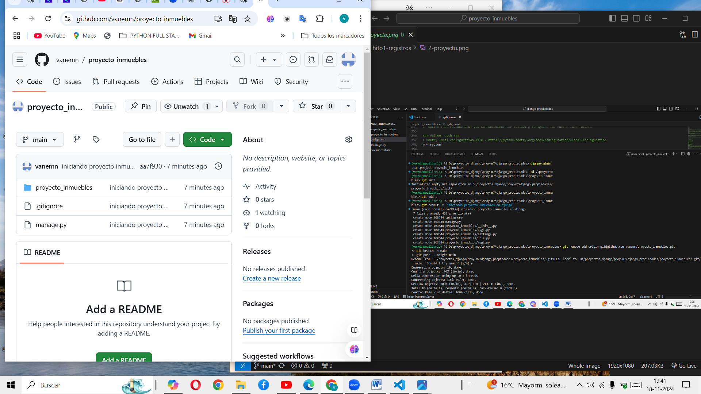
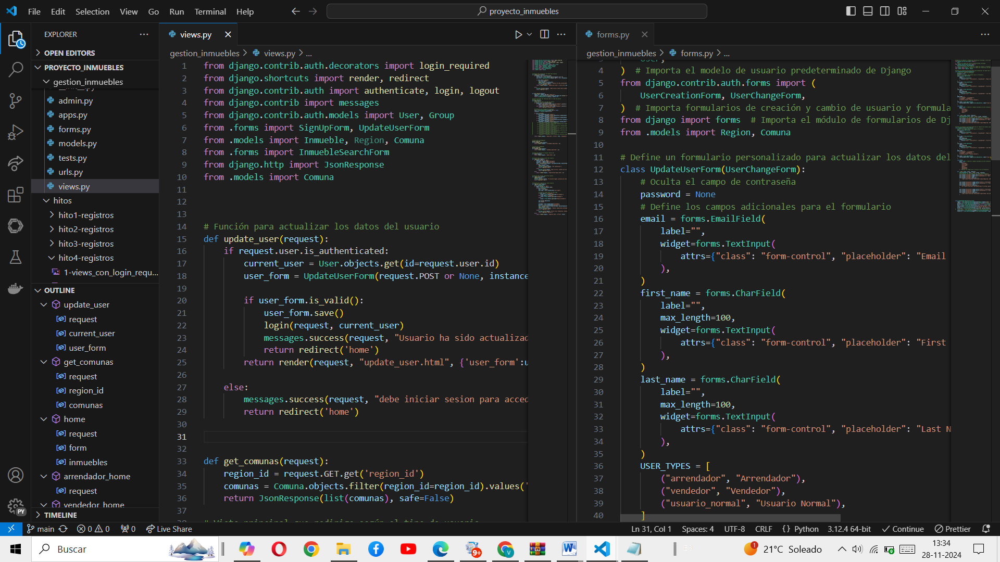

# 🏠 Proyecto Inmuebles

Este proyecto web en Django permite gestionar registros de inmuebles, usuarios y autenticación. A continuación se detallan los primeros cinco hitos del desarrollo, con enlaces a sus carpetas y capturas de pantalla representativas.

---

## 🔹 Hito 1: Configuración inicial del entorno

- Creación del entorno virtual
- Inicialización del proyecto Django
- Registro en GitHub

📂 [Ver carpeta del hito 1](./hitos/hito1-registros)

---

## 🔹 Hito 2: Registro de usuarios

- Creación del formulario de registro
- Incorporación de plantilla HTML
- Ajuste de rutas y vistas

📂 [Ver carpeta del hito 2](./hitos/hito2-registros)

---

## 🔹 Hito 3: Consultas por región

- Consultas con Python y SQL
- Segmentación de datos por región

📂 [Ver carpeta del hito 3](./hitos/hito3-registros)

---

## 🔹 Hito 4: Actualización de datos de usuario

- Formulario de edición de perfil
- Redirección tras guardar cambios
- Validaciones y control de acceso

📂 [Ver carpeta del hito 4](./hitos/hito4-registros)

---

## 🔹 Hito 5: Presentación y seguimiento

- Preparación de presentación del proyecto
- Consolidación de avances por hitos

📂 [Ver carpeta del hito 5](./hitos/hito5-registro)

---
